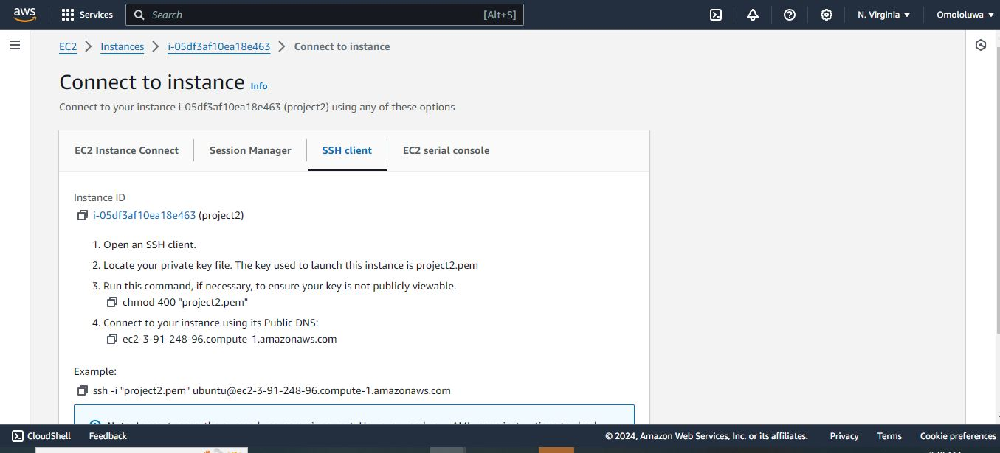

# Hello once again this Omololu David Aiyeola

## Welcome to my project 2 Documentation

### Setup Multiple Static Websites on a Single Server Using Nginx Virtual Hosts

1. Spin up a Ubuntu server & assign an elastic IP to it.

2. SSH into the server and install and configure Nignx on a server.

3. Create two website directories with two different website templates.

4. Create two subdomains

5. Add the IP of the server as A record to the two subdomains.

6. Configure the Virtual host to point two subdomains to two different website directories.

7. Validate the setup by accessing the subdomains.

8. Create a certbot SSL certificate for the root Domain.

9. Configure certbot on Nginx for the two websites.

10. Validate the subdomain websites’ SSL using OpenSSL utility.

